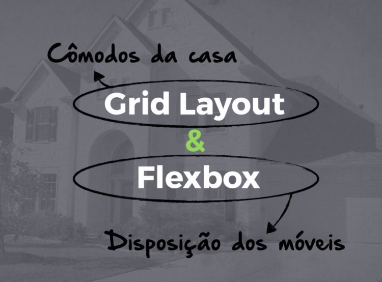

<h1 align="center">CSS Grid</h1>
<p align="center">Utilização, propriedades e valores</p>

## Conteúdo
<!--ts-->
   * [Conceito](#conceito)
   * [Inicialização](#inicialização)
   * [Propriedades do pai](#propriedades-do-pai)
      * [Grid Template Columns | Grid Template Rows](#grid-template-columns-e-grid-template-rows)
      * [Justify Content](#justify-content)
      * [Flex Wrap](#flex-wrap)
      * [Align Items](#align-items)
   * [Propriedades dos filhos](#propriedades-dos-filhos)
      * [Align Self](#align-self)
      * [Flex Grow](#flex-grow)
      * [Flex Shrink](#flex-shrink)
      * [Flex Basis](#flex-basis)
      * [Order](#order)
   * [Flex Shorthand](#flex-shorthand)
      * [Flex](#flex)
      * [Flex Flow](#flex-flow)
   * [CSS Grid x Flexbox](#css-grid-x-flexbox)
   * [Autora](#autora)
<!--te-->

## Conceito
CSS Grid Layout é o sistema de layout mais poderoso disponível em CSS.
Trabalha-se com o Grid Layout aplicando regras CSS tanto a um elemento pai (que se torna o Grid Container) quanto aos filhos desse elemento (que se tornam Grid Items).

<div align="center">
  <b>As imagens a seguir mostram um container, que é o elemento pai, com vários itens (filhos) dentro dele</b>
  <p>
    
  </p>
  <p>
    
  </p>
</div>

## Inicialização
Para utilizar as propriedades do CSS Grids, é necessário acrescentar a propriedade _display_ na customização do **elemento pai**, com um dos dois valores disponíveis.
- Valores possíveis:
    - grid -> gera grid em block-level*
    - inline-grid -> gera grid em inline-level*
    
*<a href="https://www.youtube.com/watch?v=hgoFi0fCv3w&ab_channel=CemEygiMedia" target="_blank">Entenda a diferença entre display block, inline e inline-block</a>
    
Exemplo:
```
.classeDoElementoPai { display: grid; }
```

## Propriedades do pai

### Grid Template Columns | Grid Template Rows
Definem as colunas e linhas da grade com uma lista de valores separados por espaço.
Os valores representam o tamanho da trilha e o espaço entre eles representa a linha da grid.

- Valores:
    - track-size –> pode ser um comprimento, uma porcentagem ou uma fração do espaço livre na grade
    - line-name –> Nome arbitrário das linhas

Exemplos:

1. Quando se deixa um espaço vazio entre os valores da faixa <track-size>, as linhas de grade recebem, como nome <line-name>, números positivos e negativos automaticamente:

```
.classeDoElementoPai {
  display: grid;
  grid-template-columns: 40px 50px auto 50px 40px;
  grid-template-rows: 25% 100px auto;
}
```

<div align="center">
  <b>Imagem ilustrativa do exemplo 1</b>
  <p>
    
  </p>
</div>

2. Pode-se escolher nomear explicitamente as linhas da seguinte maneira:

```
.classeDoElementoPai {
  grid-template-columns: [first] 40px [line2] 50px [line3] auto [col4-start] 50px [five] 40px [end];
  grid-template-rows: [row1-start] 25% [row1-end] 100px [third-line] auto [last-line];
}
```

<div align="center">
  <b>Imagem ilustrativa do exemplo 2</b>
  <p>
    
  </p>
</div>

3. Se a definição contém partes repetidas, pode-se usar a seguinte notação para simplificar as coisas:

```
.classeDoElementoPai { grid-template-columns: repeat(3, 20px [col-start]); }
```
O que é equivalente a:
```
.classeDoElementoPai { grid-template-columns: 20px [col-start] 20px [col-start] 20px [col-start]; }
```

4. É possível utilizar a unidade _fr_.
A unidade _fr_ permite que definir o tamanho de uma trilha como uma fração do espaço livre do container pai.
Por exemplo, se dois elementos forem definidos como 1fr e 3fr respectivamente, o espaço será dividido em 4 partes iguais:
o primeiro elemento ocupará 1/4 e o segundo elemento, 3/4 do espaço restante.

O código a seguir definirá cada item com um terço da largura do container da grid:
```
.classeDoElementoPai { grid-template-columns: 1fr 1fr 1fr; }
```

No código a seguir, o primeiro item ocupará um quarto e o segundo ocupará três quartos do container pai:
```
.classeDoElementoPai { grid-template-columns: 1fr 3fr; }
```

Porém, o espaço livre é calculado **após** quaisquer itens não flexíveis.
No exemplo a seguir, a quantidade total de espaço livre disponível para os itens com unidade _fr_ não inclui o 50px, então o primeiro, terceiro e quarto itens ocuparão, cada um, um terço do espaço restante após o item de 50px ter tomado seu próprio espaço:
```
.classeDoElementoPai { grid-template-columns: 1fr 50px 1fr 1fr; }
```

---

## Propriedades dos filhos

## Flex Shorthand

### Flex
É a abreviação para as propriedades _flex-grow_, _flex-shrink_ e _flex-basis_ combinados, nessa ordem.
O segundo e o terceiro parâmetros (_flex-shrink_ e _flex-basis_) são opcionais, mas o elemento terá os valores default automaticamente para essas propriedades. 
- Valor default: 0 1 0px
- Outros valores:
  - flex: auto - equilave à _1 1 auto_
  - flex: none - equivale à _0 0 auto_

Exemplos:
```
.classeDoElementoEspecifico { flex: 2 0 30%; }
```

```
.classeDoElementoEspecifico { flex: 1 2; }
```

```
.classeDoElementoEspecifico { flex: 1 300px; }
```

```
.classeDoElementoEspecifico { flex: 1; }
```

```
.classeDoElementoEspecifico { flex: auto; }
```
---
### Flex Flow
É a abreviação para as propriedades _flex-direction_ e _flex-wrap_, nessa ordem.
- Valor default: row nowrap

Exemplo:
```
.classeDoElementoPai { flex-flow: column wrap; }
```

## CSS Grid x Flexbox
O CSS Grid é um sistema bidimensional, o que significa que pode lidar com colunas **e** linhas, ao contrário do flexbox que é basicamente um sistema unidimensional.

<div align="center">
  <b>Comparação entre Flexbox e CSS Grid</b>
  <p>
    
  </p>
</div>

Ambos ajudam demais no alinhamento (horizontal e vertical) e no desenvolvimento de grids dentro de aplicações modernas.
Geralmente, usa-se o CSS Grid para montar a estrutura de layout da página e o flexbox para construir os "componentes" dentro desses blocos de layout do grid.

Podemos fazer a seguinte comparação:

<div align="center">
  <b>Comparação entre Flexbox e CSS Grid</b>
  <p>
    
  </p>
</div>

Ou seja, se imaginarmos uma casa, o **CSS Grid** seria responsável pela **estrutura dos cômodos** e o **flexbox** seria responsável pela **disposição dos móveis dentro desses cômodos**.
Isso porque o Flexbox é unidimensional, ou seja, linha **OU** coluna, então é perfeito para o desenvolvimento interno de COMPONENTES.
Já CSS Grid é multidimensional (ou bidimensional), ou seja, linhas **E** colunas, perfeito pra LAYOUTS.

### Autora
---

<a href="https://www.linkedin.com/in/luarakerlen/">
 
 <br />
 <sub><b>Luara Kerlen</b></sub></a> <a href="https://www.linkedin.com/in/luarakerlen/" title="Luara Kerlen"></a>


Feito com ❤️ por Luara Kerlen
<br>Entre em contato!

[](https://twitter.com/luarakerlen)
[](https://www.linkedin.com/in/luarakerlen/) 
[](mailto:luarakerlen12@gmail.com)
